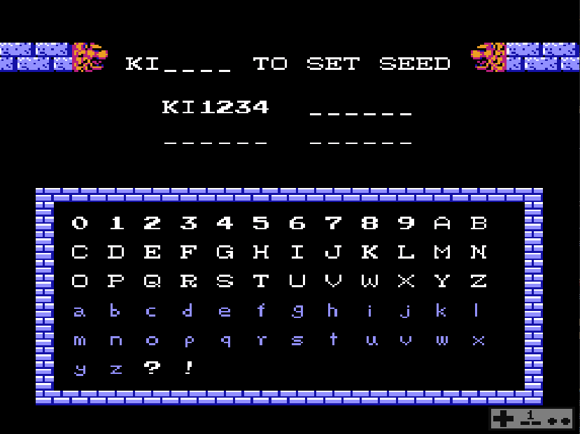

# Kid Randomicus
Pure ROM Kid Icarus randomizer

Contains several 6502 asm files and helper scripts that randomizes several features of Kid Icarus.  This is essentially ROM hack that implements the Kid Icarus Randomizer developed by myself and FruitBatSalad.

Each platforming level is randomized upon initial load, including which screens, doors, enemies, and items.

For the fortresses I generate a path so that they should be completable from any room that you can get to.  This does not count going into the corner of a room that is a deadend in and of itself, so don't go anywhere that you shouldn't =)

It also contains a shell script for compiling the assembly and patching the rom.

There is go utility that is used to automate the patching of a Kid Icarus rom for the few dozen patches that the romhack requires.  The patches fall into 3 categories:

* Large patches compiled from `.asm` files
* Smaller static patches that exist as `.bin` files 
* Tiny static patches or large overwrites of data that are done programmatically in the go utility

There's a utility go file / executable that will print out the fortress given a string of bytes that represent the fortress (128 bytes starting at location $70AF) located in `./fortress-maze-viewer`

## Specifically this game randomizes:

* The screens in the scrolling levels.  These will normally be randomized every load, which means it'll change on death, but the seed can be fixed via the password screen (see next note)
* Doors in World 1, World 2 & World 3.  There's no guarantee on the number or types of rooms you'll find, other than the game will not spawn strength upgrade rooms in world 1 if you already have a strength of +1 or higher.  It will not spawn them in world 2 if you have a strength of +3 or higher.
* Fortresses - These are randomized once per playthrough, so if you die they will always remain the same.  The fotresses get longer as the game goes on, with 1-4 being 32 rooms, 2-4 being 40 rooms, and 3-4 being 48 rooms.
* Enemies in Fortresses - If you see Eggplant Wizards be careful!  There might not be a hospital!
* World 4 screens and enemies are randomized

## Quality of Life Patches:

* Removed the hidden score requirement for upgrade rooms
* Adjusted prices to be more reasonable
* Pencil, Map, and Torch functionality are enabled by default in the fortresses so that you can find your way in the new mazes
* The pause screen will show a "seed" value for the current level.  This is helpful for me if you run into something that shouldn't happen, I can recreate the same level to investigate
* Updated Title Screen & Credits to shout out the people that have contributed to the randomizer to help make this happen
* Hammers now do more damage, they are a viable alternative if you happen to not find strength upgrades.

## Things I had to remove because I didn't want to deal with them

* Centurions in Fortresses - their default placement would sometimes block exits that I don't account for in the fortress generation

## Setting your desired seed

You can choose your starting seed, and prevent the platforming levels from re-randomizing on death by entering a password on the title screen that starts with `KI` and has anything in the next 4 characters.

